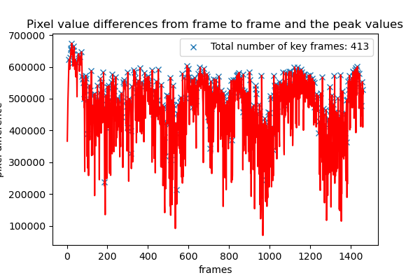

# Key Frame Identifier

This is a tool that can identify key frames in a video. Can be used in machine learning pipelines to reduce data size or balance the dataset. The thresholding is important. The input is a float value between 0 and 1 which represents the percentage change between pixels of two consecute frames. The difference is calculated using OpenCV's absolute difference function. The scripts takes directory and threshold and returns a csv file with video name and key frames along with a plot of the difference of all frames. 




## Usage

```python
python main.py --video directory --threshold
```

## License
[MIT](https://choosealicense.com/licenses/mit/)
